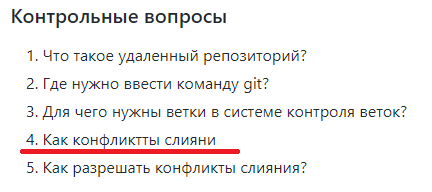

# Study_Practice

Репозиторий для практикумов

[«Файловый менеджер»](https://github.com/bitcoineazy/Study_Practice/tree/main/Python/FileManager) — написание программы, имитирующей работу файлового менеджера операционной системы.

[«TCP-клиент и эхо-сервер»](https://github.com/bitcoineazy/Study_Practice/tree/main/Python/EchoServer) — создание клиент-серверной архитектуры по принципу эхо-сервера.

[«Создание простого многопоточного сервера»](https://github.com/bitcoineazy/Study_Practice/tree/main/Python/ThreadedServer) — реализация сервера с возможностью многопоточной работы с клиентом.

---

## Контрольные вопросы

### Контрольные вопросы на «Основы работы с СКВ в графическом режиме»
1. Опишите своими словами следующие термины:
   * рабочий каталог
   >*Ответ: папка с файлами проекта*
   * репозиторий
   >*Ответ: папка, в которой отслеживаются изменения проекта*
   * коммит
   >*Ответ: сохраниение изменений в репозитории и коментарий к ним*
   * ветка
   >*Ответ: альтернативная реализация проекта*

### Контрольные вопросы на «Работа с Git в терминале»
1. Что такое удалённый репозиторий?
>*Ответ: это репозиторий, находящийся на удалённом сервере,
> и который выполняет все те же функции, что и репозиторий на локальной машине (в терминале),
> но с возможностью удалённого хранения данных*
2. Где нужно ввести команду git?
>*Ответ: в терминал (или в терминал git Bash), а также в графических оболочках git*
3. Для чего нужны ветки в системе контроля веток?
>*Ответ: для ведения альтернотивного развития проекта,
> а также разделения деятельности между разработчиками и их кооперации, 
> тестирования и добавления новых функций*
4. Как возникают конфликты слияния?
>*Ответ: они обычно возникают, когда два разработчика изменяют одни и те же строки в файле проекта или один удаляет файл, который в это время изменяет другой. Конфликт во время слияния может произойти в двух отдельных точках — при запуске и во время процесса слияния.*

В исходном README.md репозитория лабораторной работы некорректно задан вопрос:

5. Как разрешать конфликты слияния?
>*Ответ: в случае возникновения ошибки слияния git просит решить программиста конфликт, отредактировав файлы вручную, и делает новый коммит*

### Контрольные вопросы на «Работа с удалёнными репозиториями и GitHub»
1. Зачем нужен облачный хостинг репозиториев?
>*Ответ: для безопасности всех изменений проекта и его истории (защита от потери данных в случае повреждения локального носителя), а также
> для удобства (возможность работать над проектом из разных мест и с разных устройств)*
2. Какими свойствами обладает сайт github.com?
>*Ответ: создание и хранение репозиториев пользователя,
> получение и отправка данных из репозитория на локальный компьютер,
> прямая работа с репозиториями (их создание, реализация коммитов, решение конфликтов слияния и проблем, слияние коммитов, создание новых веток и их слияние и многое другое)*
3. Как организовать командную работу над проектом?
>*Ответ: первый способ — это создать для каждого программиста отдельную ветку, после чего объединять их в основной проект,
> второй способ — это создание веток для отдельного функционала и (в случае успешной реализации данной разработчикам задачи)
> их объединение с веткой основного проекта или отклонение наработок программиста в ветке (в случае потери необходимости в данном функционале)*
